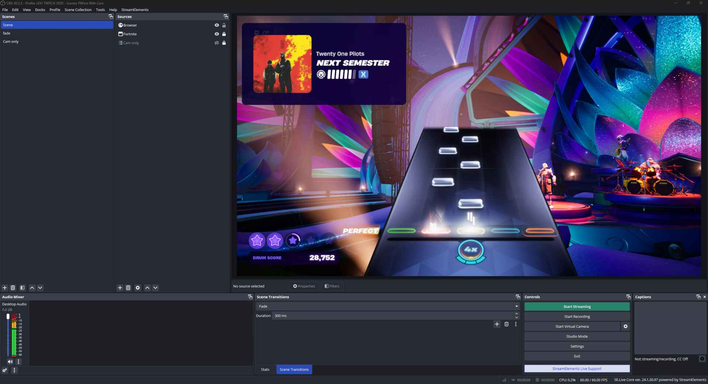

# FNFest-Status
Monitor and display the status of Fortnite Festival events.

## Features
- Displays currently playing song information, like difficulty, intensity and album art.
- Includes a Flask web app that can be used in OBS to display information on stream.

## What does it do?
You can use the demo web app I created to add a "Now Playing" widget to your streams by adding it as a Browser Source in OBS (further insctructions [below](#usage))

The script (`playerStatus.py`) simply reads your Fortnite log file (located in `%localappdata%\FortniteGame\Saved\Logs\FortniteGame.log`) and filters it for known events relating to Fortnite Festival. It calls on a [cached version](https://github.com/LeviSnoot/FNFest-Content-API) of the public [Fortnite Festival Content API](https://fortnitecontent-website-prod07.ol.epicgames.com/content/api/pages/fortnite-game/spark-tracks) to match song ID's from the log to their metadata such as track and artist names.

## Prerequisites
- Python 3.9 or higher
- Fortnite
- Windows

## Installation
1. Clone the repository
    ```sh
    git clone https://github.com/LeviSnoot/FNFest-Status.git
    cd FNFest-Status
    ```
2. *(Optional, but recommended)* Create a virtual environment
    ```sh
    python -m venv venv
    .\venv\Scripts\activate
    ```
3. Install the required dependencies
    ```sh
    pip install -r requirements.txt
    ```

## Usage

Run `OBSWidget.py` to start the web server and status monitor. This will allow you to display the currently playing song and other information in OBS.

```sh
python OBSWidget.py 
```

If you have a service already running on port `5000`, make a copy of `config-example.ini`, rename it to `config.ini` and change the port value inside to whatever you'd like. You'll be able to access the web app at `http://127.0.0.1:<port-number>`.

The script currently works best if you start it after Fortnite has launched and you're in the lobby. I plan to make it work more robustly as a background service in future updates.

## Displaying in OBS

Once you've started `OBSWidget.py`, add a browser source in OBS.

**URL:** `http://127.0.0.1:<port-number>`

**Width:** 720 - 1280px

**Height:** 400px

- [x] Use custom frame rate

**FPS:** 60

Leave everything else default, including Custom CSS.

[](https://youtu.be/eJFkqqlJuFY)
Click the image above for a video demo.

# Updating

Just pull the repo for now. If you don't know how to do this, just navigate to where you first cloned the repo, and in that directory, do:
```sh
git pull
```

# Roadmap

Check the [Projects](https://github.com/users/LeviSnoot/projects/1) section.

## Known issues
- Does not handle *multiplayer* Main Stage lobbies correctly. When I've inspected Fortnite's log file, I have been unable to find a reliable way to identify which player is the local player. Feel free to create a pull request if you have a solution. Related issue thread: [#15](https://github.com/LeviSnoot/FNFest-Status/issues/15)

## Disclaimer

This project is not affiliated with, endorsed by, or in any way associated with Epic Games or Fortnite. All product names, trademarks, and registered trademarks are property of their respective owners.

## License

This project is licensed under the MIT License. See the [LICENSE](LICENSE) file for details.