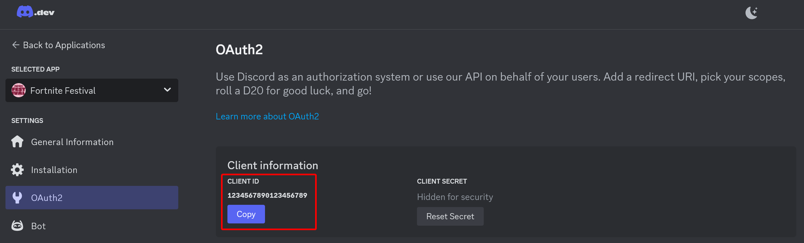
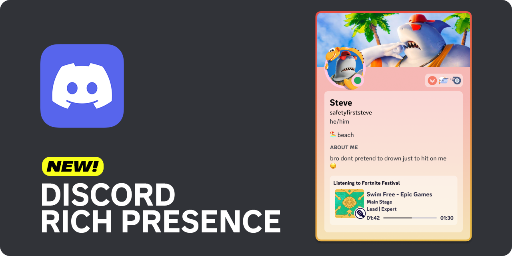

# FNFest-Status
Monitor and display the status of Fortnite Festival events.

## Features
- Displays currently playing song information, like difficulty, intensity and album art.
- Includes a Flask web app that can be used in OBS to display information on stream.
- **NEW!** Displays your status in Discord.

## What does it do?
You can use the demo web app I created to add a "Now Playing" widget to your streams by adding it as a Browser Source in OBS (further insctructions [below](#stream-widget))

The script (`playerStatus.py`) simply reads your Fortnite log file (located in `%localappdata%\FortniteGame\Saved\Logs\FortniteGame.log`) and filters it for known events relating to Fortnite Festival. It calls on a [cached version](https://github.com/LeviSnoot/FNFest-Content-API) of the public [Fortnite Festival Content API](https://fortnitecontent-website-prod07.ol.epicgames.com/content/api/pages/fortnite-game/spark-tracks) to match song ID's from the log to their metadata such as track and artist names.

## Prerequisites
- Python 3.9 or higher
- Fortnite
- Windows

## Installation
1. Clone the repository
    ```sh
    git clone https://github.com/LeviSnoot/FNFest-Status.git
    cd FNFest-Status
    ```
2. *(Optional, but recommended)* Create a virtual environment
    ```sh
    python -m venv venv
    .\venv\Scripts\activate
    ```
3. Install the required dependencies
    ```sh
    pip install -r requirements.txt
    ```

## Config

### Creating config file
Copy `config-example.ini` and rename it to `config.ini`.

### Port number
If you have a service already running on port `5000`, change the port value under `[obswidget]` -> `port` to whatever you'd like. You'll be able to access the web app at `http://127.0.0.1:<port-number>`.

### Discord Client ID
If you plan to use the Discord Rich Presence, you first need to create an application in the [Discord Developer Portal](https://discord.com/developers/applications) (a guide is provided in the [Discord Rich Presence](#discord-rich-presence) section). You'll find the Client ID of your application in the Oath2 section of your app.



Replace the dummy value under `[DISCORD]` -> `client_id` with the actual Client ID of your application.

## Usage

Run `main.py` to start the status monitor. This will only be useful if you're debugging or developing other uses that leverage the resulting `status.json` file that is created.

```sh
python main.py 
```

If you run `main.py` with the CLI options `--web` and/or `--discord` you will have a lot more useful functionality, which is further described in the [Stream Widget](#stream-widget) and [Discord Rich Presence](#discord-rich-presence) sections.

```sh
python main.py --web --discord
```

The script currently works best if you start it after Fortnite has launched and you're in the lobby. I plan to make it work more robustly as a background service in future updates.

## Stream Widget

Once you've started `main.py` with `--web`, add a browser source in OBS (or any other streaming software that supports browser sources).

**URL:** `http://127.0.0.1:<port-number>`

**Width:** 720 - 1280px

**Height:** 400px

- [x] Use custom frame rate

**FPS:** 60

Leave everything else default, including Custom CSS.

# Discord Rich Presence



[](https://github.com/qwertyquerty/pypresence)

To show your status in Fortnite Festival in Discord, you need to launch `main.py` with `--discord`. But some setup is going to be required first. Here's what you need to do:

1. Create a new Application in [Discord's Developer Portal](https://discord.com/developers/applications). You should name this application "Fortnite Festival", as the name of the app affects how the presence is displayed.
2. *(Optional)* You can upload an app icon which will be displayed in idle states.
3. Copy the Client ID from the OAuth2 tab on the left side of your application, and paste it into your `config.ini` as described in the [Config](#config) section.

# Updating

Just pull the repo for now. If you don't know how to do this, just navigate to where you first cloned the repo, and in that directory, do:
```sh
git pull
```

# Roadmap

Check the [Projects](https://github.com/users/LeviSnoot/projects/1) section.

## Known issues
- Does not handle *multiplayer* Main Stage lobbies correctly. When I've inspected Fortnite's log file, I have been unable to find a reliable way to identify which player is the local player. Feel free to create a pull request if you have a solution. Related issue thread: [#15](https://github.com/LeviSnoot/FNFest-Status/issues/15)

## Disclaimer

This project is not affiliated with, endorsed by, or in any way associated with Epic Games, Fortnite or Discord. All product names, trademarks, and registered trademarks are property of their respective owners.

## License

This project is licensed under the MIT License. See the [LICENSE](LICENSE) file for details.